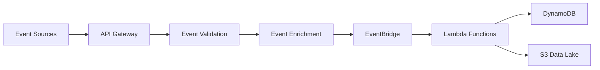
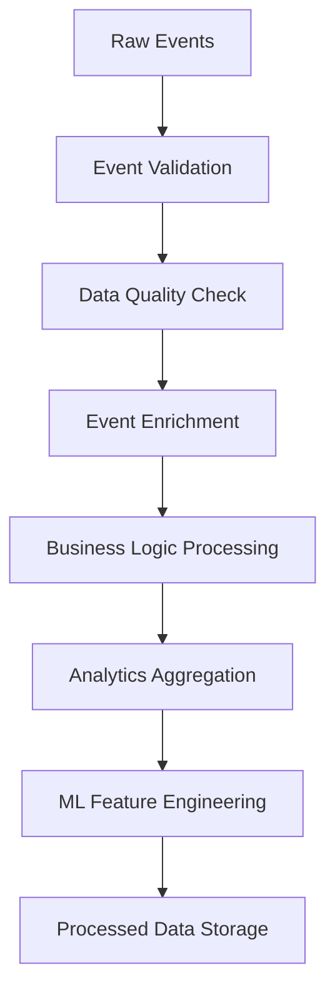

# Data Architecture Document
## Event-Driven Microservices Platform

**Version:** 1.0  
**Date:** December 2024  
**Status:** Draft  
**Owner:** Data Engineering Team  

---

## Table of Contents
1. [Data Architecture Overview](#data-architecture-overview)
2. [Data Design Principles](#data-design-principles)
3. [Data Models](#data-models)
4. [Data Storage Strategy](#data-storage-strategy)
5. [Data Flow Architecture](#data-flow-architecture)
6. [Data Quality & Governance](#data-quality--governance)
7. [Data Security & Privacy](#data-security--privacy)
8. [Data Lifecycle Management](#data-lifecycle-management)
9. [Data Integration Patterns](#data-integration-patterns)
10. [Analytics & Reporting](#analytics--reporting)

---

## Data Architecture Overview

### Data Architecture Vision
The data architecture supports a scalable, event-driven platform that processes millions of events daily while maintaining data integrity, security, and performance. The architecture follows modern data engineering principles with a focus on real-time processing, analytics, and machine learning capabilities.

### Data Architecture Layers

```
┌─────────────────────────────────────────────────────────────┐
│                    Data Access Layer                        │
│  • APIs, Dashboards, Analytics, ML Models                  │
└─────────────────────┬───────────────────────────────────────┘
                      │
┌─────────────────────▼───────────────────────────────────────┐
│                   Data Processing Layer                     │
│  • Lambda Functions, ETL Pipelines, Stream Processing      │
└─────────────────────┬───────────────────────────────────────┘
                      │
┌─────────────────────▼───────────────────────────────────────┐
│                    Data Storage Layer                       │
│  • DynamoDB, S3, RDS, ElastiCache, Feature Store           │
└─────────────────────┬───────────────────────────────────────┘
                      │
┌─────────────────────▼───────────────────────────────────────┐
│                   Data Ingestion Layer                      │
│  • Event Sources, APIs, Streams, Batch Imports             │
└─────────────────────────────────────────────────────────────┘
```

---

## Data Design Principles

### 1. Event-Driven Data Design
- **Event Sourcing**: All state changes captured as immutable events
- **Event-First**: Design data models around events, not entities
- **Temporal Data**: Maintain data lineage and historical context
- **CQRS**: Separate read and write data models

### 2. Scalable Data Design
- **Horizontal Scaling**: Design for distributed data processing
- **Partitioning**: Efficient data distribution across nodes
- **Indexing**: Optimize for query patterns and access patterns
- **Caching**: Strategic caching for performance optimization

### 3. Data Quality & Governance
- **Data Validation**: Schema enforcement and data quality checks
- **Data Lineage**: Track data origin and transformation history
- **Data Catalog**: Centralized metadata management
- **Data Classification**: Automated data tagging and classification

### 4. Security & Privacy
- **Encryption**: Data encrypted at rest and in transit
- **Access Control**: Role-based data access permissions
- **Data Masking**: Sensitive data protection
- **Compliance**: GDPR, SOC 2, and industry compliance

### 5. Performance & Optimization
- **Query Optimization**: Efficient data access patterns
- **Storage Optimization**: Cost-effective storage strategies
- **Data Compression**: Reduce storage costs and improve performance
- **Lifecycle Management**: Automated data archival and deletion

---

## Data Models

### Event Schema Design

#### Core Event Schema
```json
{
  "eventId": "uuid-v4",
  "eventType": "string",
  "eventSource": "string",
  "timestamp": "ISO-8601",
  "version": "string",
  "data": {
    "payload": "object",
    "metadata": "object"
  },
  "correlationId": "string",
  "userId": "string",
  "sessionId": "string",
  "environment": "string",
  "region": "string"
}
```

#### Event Type Categories

##### 1. User Events
```json
{
  "eventType": "user.registered",
  "data": {
    "payload": {
      "userId": "string",
      "email": "string",
      "firstName": "string",
      "lastName": "string",
      "registrationSource": "string"
    },
    "metadata": {
      "ipAddress": "string",
      "userAgent": "string",
      "referrer": "string"
    }
  }
}
```

##### 2. Business Events
```json
{
  "eventType": "order.created",
  "data": {
    "payload": {
      "orderId": "string",
      "userId": "string",
      "items": [
        {
          "productId": "string",
          "quantity": "number",
          "price": "number"
        }
      ],
      "totalAmount": "number",
      "currency": "string"
    },
    "metadata": {
      "paymentMethod": "string",
      "shippingAddress": "object"
    }
  }
}
```

##### 3. System Events
```json
{
  "eventType": "system.health.check",
  "data": {
    "payload": {
      "serviceName": "string",
      "status": "string",
      "responseTime": "number",
      "errorCount": "number"
    },
    "metadata": {
      "instanceId": "string",
      "region": "string",
      "availabilityZone": "string"
    }
  }
}
```

##### 4. Integration Events
```json
{
  "eventType": "integration.webhook.received",
  "data": {
    "payload": {
      "webhookId": "string",
      "source": "string",
      "payload": "object"
    },
    "metadata": {
      "headers": "object",
      "signature": "string",
      "processingTime": "number"
    }
  }
}
```

##### 5. AI/ML Events
```json
{
  "eventType": "ml.model.inference",
  "data": {
    "payload": {
      "modelId": "string",
      "modelVersion": "string",
      "input": "object",
      "output": "object",
      "confidence": "number"
    },
    "metadata": {
      "inferenceTime": "number",
      "endpoint": "string",
      "modelType": "string"
    }
  }
}
```

### Data Model Relationships

#### Entity Relationship Model
```
User (1) ──── (N) Events
User (1) ──── (N) Sessions
User (1) ──── (N) Orders
Order (1) ──── (N) OrderItems
Product (1) ──── (N) OrderItems
Event (1) ──── (N) EventMetadata
Model (1) ──── (N) ModelInferences
```

#### Event Correlation Model
```
Event ──── CorrelationId ──── Related Events
Event ──── UserId ──── User Events
Event ──── SessionId ──── Session Events
Event ──── OrderId ──── Order Events
```

---

## Data Storage Strategy

### DynamoDB Table Design

#### 1. Events Table
```yaml
TableName: Events
PartitionKey: eventId (String)
SortKey: timestamp (String)
TTL: 90 days

Global Secondary Indexes:
  - eventType-timestamp-index
    PartitionKey: eventType
    SortKey: timestamp
    
  - userId-timestamp-index
    PartitionKey: userId
    SortKey: timestamp
    
  - correlationId-timestamp-index
    PartitionKey: correlationId
    SortKey: timestamp
```

#### 2. User Events Table
```yaml
TableName: UserEvents
PartitionKey: userId (String)
SortKey: timestamp (String)
TTL: 365 days

Global Secondary Indexes:
  - eventType-timestamp-index
    PartitionKey: eventType
    SortKey: timestamp
    
  - sessionId-timestamp-index
    PartitionKey: sessionId
    SortKey: timestamp
```

#### 3. Analytics Table
```yaml
TableName: Analytics
PartitionKey: date (String)
SortKey: metricType (String)
TTL: 1095 days

Global Secondary Indexes:
  - userId-metricType-index
    PartitionKey: userId
    SortKey: metricType
    
  - eventType-date-index
    PartitionKey: eventType
    SortKey: date
```

#### 4. Metadata Table
```yaml
TableName: Metadata
PartitionKey: entityType (String)
SortKey: entityId (String)
TTL: None

Global Secondary Indexes:
  - userId-status-index
    PartitionKey: userId
    SortKey: status
```

#### 5. ML Models Table
```yaml
TableName: MLModels
PartitionKey: modelId (String)
SortKey: version (String)
TTL: None

Global Secondary Indexes:
  - modelType-status-index
    PartitionKey: modelType
    SortKey: status
    
  - performance-version-index
    PartitionKey: performance
    SortKey: version
```

#### 6. Feature Store Table
```yaml
TableName: FeatureStore
PartitionKey: featureGroupId (String)
SortKey: timestamp (String)
TTL: 365 days

Global Secondary Indexes:
  - featureName-dataType-index
    PartitionKey: featureName
    SortKey: dataType
```

### S3 Data Lake Structure

#### Data Lake Organization
```
s3://data-lake/
├── raw/
│   ├── events/
│   │   ├── year=2024/
│   │   │   ├── month=12/
│   │   │   │   ├── day=01/
│   │   │   │   └── day=02/
│   │   ├── user-events/
│   │   ├── business-events/
│   │   └── system-events/
│   ├── logs/
│   └── external-data/
├── processed/
│   ├── analytics/
│   ├── features/
│   └── ml-datasets/
└── curated/
    ├── business-intelligence/
    ├── reporting/
    └── ml-training/
```

### RDS/Aurora Tables

#### User Management
```sql
CREATE TABLE users (
    user_id VARCHAR(36) PRIMARY KEY,
    email VARCHAR(255) UNIQUE NOT NULL,
    first_name VARCHAR(100),
    last_name VARCHAR(100),
    status VARCHAR(20) DEFAULT 'active',
    created_at TIMESTAMP DEFAULT CURRENT_TIMESTAMP,
    updated_at TIMESTAMP DEFAULT CURRENT_TIMESTAMP ON UPDATE CURRENT_TIMESTAMP
);

CREATE TABLE user_sessions (
    session_id VARCHAR(36) PRIMARY KEY,
    user_id VARCHAR(36),
    started_at TIMESTAMP DEFAULT CURRENT_TIMESTAMP,
    ended_at TIMESTAMP NULL,
    FOREIGN KEY (user_id) REFERENCES users(user_id)
);
```

#### Business Data
```sql
CREATE TABLE orders (
    order_id VARCHAR(36) PRIMARY KEY,
    user_id VARCHAR(36),
    total_amount DECIMAL(10,2),
    currency VARCHAR(3),
    status VARCHAR(20),
    created_at TIMESTAMP DEFAULT CURRENT_TIMESTAMP,
    FOREIGN KEY (user_id) REFERENCES users(user_id)
);

CREATE TABLE order_items (
    item_id VARCHAR(36) PRIMARY KEY,
    order_id VARCHAR(36),
    product_id VARCHAR(36),
    quantity INT,
    price DECIMAL(10,2),
    FOREIGN KEY (order_id) REFERENCES orders(order_id)
);
```

---

## Data Flow Architecture

### Event Ingestion Flow

#### 1. Event Reception


#### 2. Event Processing Pipeline


### Data Processing Patterns

#### 1. Real-time Processing
- **Stream Processing**: Kinesis + Lambda for real-time event processing
- **Event Correlation**: Real-time event correlation and pattern detection
- **Alerting**: Real-time anomaly detection and alerting
- **Dashboard Updates**: Real-time dashboard and metric updates

#### 2. Batch Processing
- **ETL Pipelines**: Daily batch processing for analytics
- **Data Aggregation**: Hourly/daily data aggregation and summarization
- **ML Training**: Batch model training on historical data
- **Data Archival**: Automated data archival and cleanup

#### 3. Hybrid Processing
- **Lambda + Step Functions**: Orchestrated data processing workflows
- **Event Sourcing**: Event replay and state reconstruction
- **CQRS**: Separate read and write data processing paths
- **Data Synchronization**: Real-time and batch data synchronization

---

## Data Quality & Governance

### Data Quality Framework

#### 1. Data Validation Rules
```yaml
Event Validation:
  - Required Fields: eventId, eventType, timestamp, data
  - Data Types: String, Number, Boolean, Object
  - Format Validation: UUID, ISO-8601, Email
  - Business Rules: User exists, Order valid, Amount positive

Data Quality Metrics:
  - Completeness: > 99%
  - Accuracy: > 95%
  - Consistency: > 98%
  - Timeliness: < 5 minutes
```

#### 2. Data Quality Monitoring
- **Real-time Validation**: Schema validation on event ingestion
- **Data Profiling**: Automated data quality assessment
- **Anomaly Detection**: ML-based data quality anomaly detection
- **Quality Dashboards**: Real-time data quality metrics

### Data Governance

#### 1. Data Catalog
```yaml
Metadata Management:
  - Data Dictionary: Centralized data definitions
  - Schema Registry: Event schema versioning
  - Lineage Tracking: Data flow and transformation tracking
  - Business Glossary: Business term definitions
```

#### 2. Data Classification
```yaml
Data Sensitivity Levels:
  - Public: Non-sensitive, publicly available data
  - Internal: Company internal data
  - Confidential: Sensitive business data
  - Restricted: Highly sensitive, regulated data
```

---

## Data Security & Privacy

### Data Security Framework

#### 1. Encryption Strategy
```yaml
Encryption at Rest:
  - DynamoDB: AES-256 encryption
  - S3: Server-side encryption (SSE-S3)
  - RDS: AES-256 encryption
  - EBS: AES-256 encryption

Encryption in Transit:
  - TLS 1.3 for all communications
  - API Gateway: HTTPS only
  - Database: SSL/TLS connections
  - Internal: VPC encryption
```

#### 2. Access Control
```yaml
Authentication:
  - IAM Roles: Service-to-service authentication
  - JWT Tokens: User authentication
  - API Keys: External API access
  - MFA: Multi-factor authentication

Authorization:
  - RBAC: Role-based access control
  - ABAC: Attribute-based access control
  - Data-level permissions: Row/column level security
  - API-level permissions: Endpoint access control
```

### Privacy & Compliance

#### 1. GDPR Compliance
```yaml
Data Protection:
  - Data Minimization: Collect only necessary data
  - Consent Management: Explicit user consent tracking
  - Right to Erasure: Data deletion procedures
  - Data Portability: User data export capabilities
  - Privacy by Design: Privacy built into architecture
```

#### 2. Data Masking & Anonymization
```yaml
Data Protection Techniques:
  - PII Masking: Personal data obfuscation
  - Data Anonymization: Statistical anonymization
  - Tokenization: Sensitive data tokenization
  - Encryption: Field-level encryption
```

---

## Data Lifecycle Management

### Data Lifecycle Strategy

#### 1. Data Retention Policies
```yaml
Retention Periods:
  - Hot Data: 0-7 days (High performance access)
  - Warm Data: 8-90 days (Standard access)
  - Cold Data: 90+ days (Archival storage)
  - Analytics Data: 3+ years (Long-term retention)
  - ML Training Data: 5+ years (Model training)
```

#### 2. Data Archival Strategy
```yaml
Archival Process:
  - Automated Archival: S3 lifecycle policies
  - Glacier Storage: Cost-effective long-term storage
  - Data Compression: Reduce storage costs
  - Index Management: Archive old indexes
```

### Data Cleanup & Maintenance

#### 1. Automated Cleanup
- **TTL Management**: Automatic data expiration
- **Orphaned Data**: Cleanup of unused data
- **Duplicate Removal**: Deduplication processes
- **Index Optimization**: Regular index maintenance

#### 2. Data Maintenance
- **Backup Verification**: Regular backup testing
- **Data Integrity**: Checksum validation
- **Performance Optimization**: Query optimization
- **Storage Optimization**: Cost optimization

---

## Data Integration Patterns

### Integration Architecture

#### 1. Event-Driven Integration
```yaml
Integration Patterns:
  - Event Streaming: Real-time data streaming
  - Message Queues: Reliable message delivery
  - Webhooks: Push-based integrations
  - API Integration: REST/GraphQL APIs
```

#### 2. Batch Integration
```yaml
Batch Patterns:
  - ETL Pipelines: Extract, Transform, Load
  - Data Warehousing: Analytics data integration
  - File Processing: CSV, JSON, Parquet files
  - Database Replication: Cross-database synchronization
```

### External Data Integration

#### 1. Third-Party Integrations
```yaml
Integration Types:
  - Payment Processors: Stripe, PayPal data
  - Email Services: SendGrid, SES metrics
  - Analytics: Google Analytics, Mixpanel
  - CRM Systems: Salesforce, HubSpot
```

#### 2. Data Synchronization
```yaml
Sync Strategies:
  - Real-time Sync: Event-driven synchronization
  - Batch Sync: Scheduled data synchronization
  - Incremental Sync: Delta-based synchronization
  - Full Sync: Complete data refresh
```

---

## Analytics & Reporting

### Analytics Architecture

#### 1. Real-time Analytics
```yaml
Real-time Capabilities:
  - Event Stream Analytics: Real-time event processing
  - Live Dashboards: Real-time metric visualization
  - Alerting: Real-time anomaly detection
  - Operational Intelligence: Real-time operational insights
```

#### 2. Batch Analytics
```yaml
Batch Capabilities:
  - Data Warehousing: Historical data analysis
  - Business Intelligence: Structured reporting
  - Advanced Analytics: Statistical analysis
  - ML Model Training: Predictive analytics
```

### Reporting Framework

#### 1. Dashboard Strategy
```yaml
Dashboard Types:
  - Executive Dashboards: High-level business metrics
  - Operational Dashboards: Real-time operational metrics
  - Analytical Dashboards: Deep-dive analytics
  - Custom Dashboards: User-specific views
```

#### 2. Report Types
```yaml
Report Categories:
  - Operational Reports: Daily operational metrics
  - Analytical Reports: Business intelligence reports
  - Predictive Reports: ML-based predictions
  - Compliance Reports: Regulatory reporting
```

### Data Visualization

#### 1. Visualization Tools
- **CloudWatch Dashboards**: AWS-native visualization
- **QuickSight**: Business intelligence platform
- **Custom Dashboards**: React/Vue.js applications
- **Third-party Tools**: Tableau, Power BI integration

#### 2. Visualization Patterns
```yaml
Chart Types:
  - Time Series: Event trends over time
  - Bar Charts: Categorical data comparison
  - Pie Charts: Proportional data representation
  - Heat Maps: Multi-dimensional data visualization
  - Scatter Plots: Correlation analysis
```

---

**Document Version**: 1.0  
**Last Updated**: December 2024  
**Next Review**: January 2025  
**Document Owner**: Data Engineering Team  
**Approval Status**: Draft
